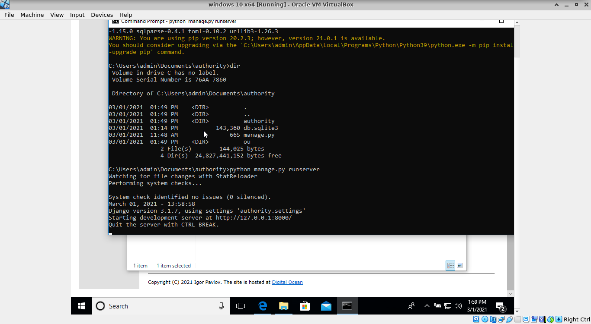
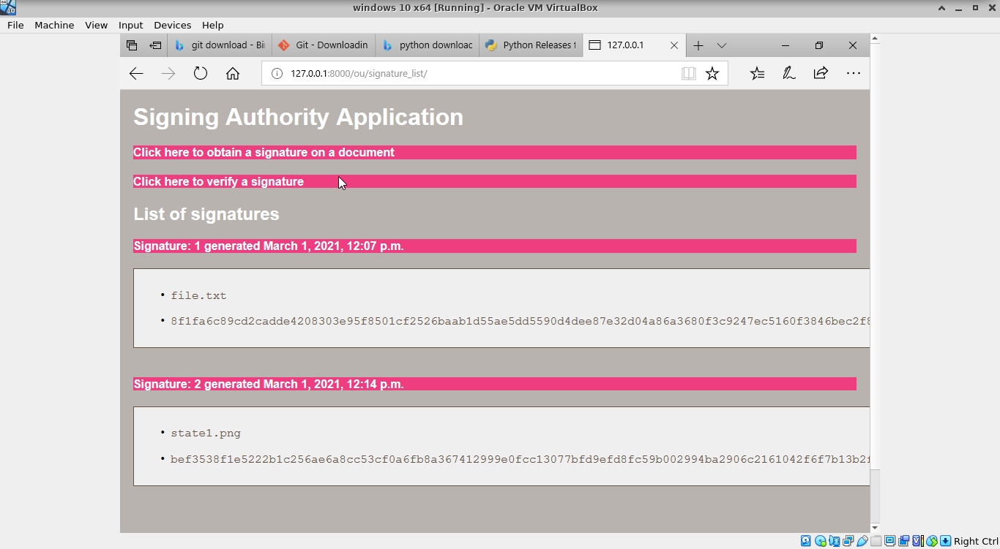
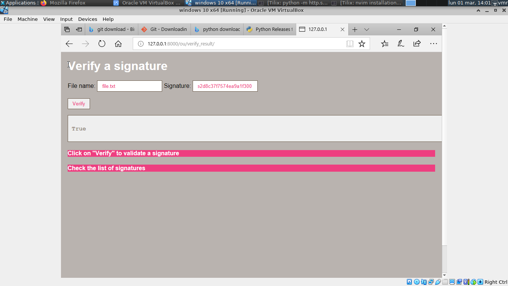
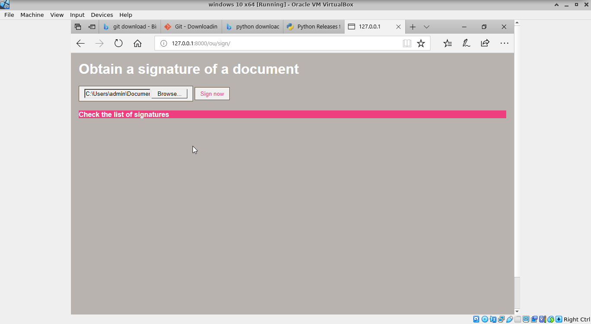

## Downloading the course application

The course application consists of a digital signature authority that
can generate a signature on a file that is uploaded. Moreover, it presents
a list of signatures and it is possible to verify the signature of a file
that has been signed by the application.

The database of the application (we are using sqlite, embedded in the application)
contains a table Keys, including a private and a public key that are used
in the application. Moreover, it includes a table Signatures that is used
to store each signature related to a certain file.


Within the app directory (e.g. src/authority) and using the virtual environment, run:

```
python manage.py runserver
```

This starts the application in Django. Then, go to 
http://127.0.0.1:8000/ou/signature_list/ you should
see the main page of the application. From here, you can see
two signatures created on two files and links to generate signatures
and verify them.

1. Starting the application:



2. The main page consists of a list of signatures:



3. You can now copy a signature and with the file name, verify it:



4. Obtaining a signature from a new file:




