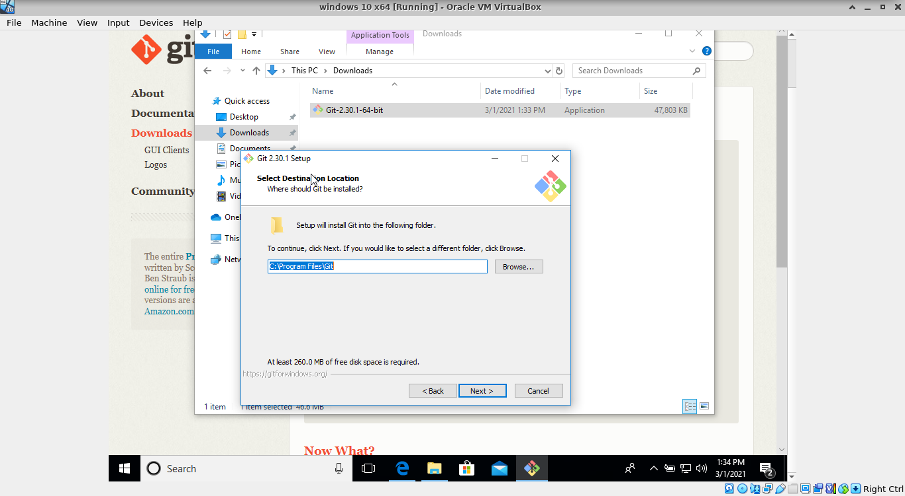

## Installation instructions

### Installing git

Install git in linux with apt-get install git if you are using a Debian
distribution such as Ubuntu. Otherwise, you can download git
from https://git-scm.com/download. You should add git to the path.

1. Download git:


2. Install git:



3. You can use Notepad as editor or another editor you like and
have installed in Windows:


4. Add git to the PATH selecting the second option (default):


5. Open the command line and type git; you should see the output
like the following:


### Installing Python and the Python requirements 

#### In Linux:

We expect you to use Python 3:

```
apt-get install python3 
```

Install also pip:

```
apt-get install python3-pip
```

#### In Windows:

- Download the latest release for Windows, selecting yes
during the installation to add Python to the path:
    https://www.python.org/downloads/windows/

1. The installer packages for you architecture are ideal:


2. Do not forget to click the option "Add Python 3.9 to PATH":


3. If the installer has finished, open the command line and type
'python'. You should enter Python in interactive mode. Leave
with exit():


### Creating a virtual environment

Python allows you to create a virtual environment where certain versions of additional modules or dependencies will be installated. Thanks to the virtual environment, the operating system and the Python installation will remain intact since the dependencies will be only installed within the virtual environment.

First, install venv if you are using Linux:

```
apt-get install python3-venv
```

Then, create a directory where you will be working and create a virtual environment:

```
$ python3 -m venv project
$ ls
project
$ ls project 
bin  include  lib  lib64  pyvenv.cfg  share
```

If you are using Linux, you should activate the virtual environment every time you work on your project with:

```
$ source project/bin/activate
```

Otherwise, if you are using Windows you can invoke the virtual environment from the command line via:

```
project\Scripts\activate.bat
```

You can leave the virtual environment using exit.

### Cloning the project sources

Download the course prototype application from yOUlearn.

### Installing the project dependencies

Go to the course application directory using the virtual environment, and install now the dependencies using
pip and the requirements.txt file (located at ou_software_eng/tree/main/src):

```
$ (project)  /tmp/work_ou/ou_software_eng/src: pip3 install -r requirements.txt 
Collecting asgiref==3.3.4
...
```


You can read more about the required dependencies and how
they work at:

- [Django framework](https://www.djangoproject.com/)                
- [Python ECDSA](https://pypi.org/project/ecdsa/)                   
- [Django REST framework](https://www.django-rest-framework.org/)   
- [HTTPie](https://httpie.io/)                                     
- [Pytest](https://docs.pytest.org/en/stable/)                  


