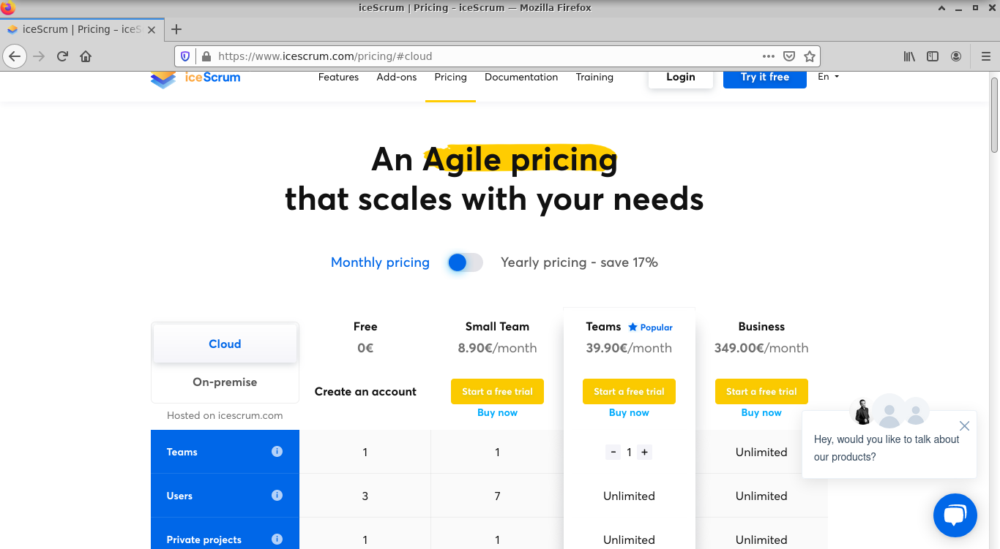
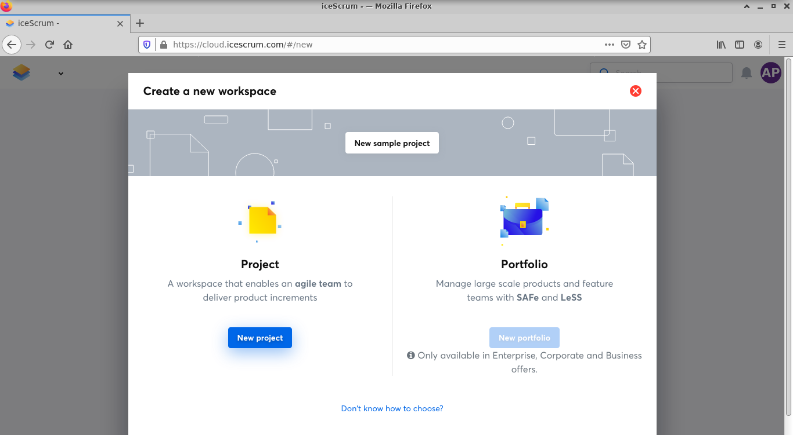
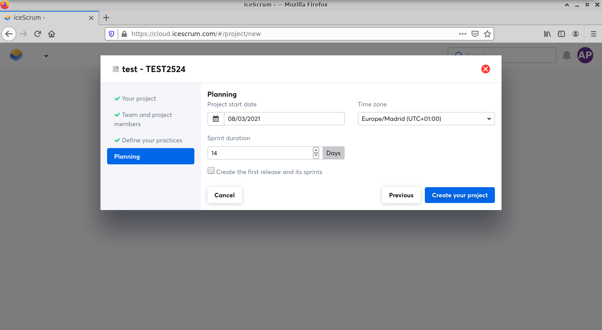
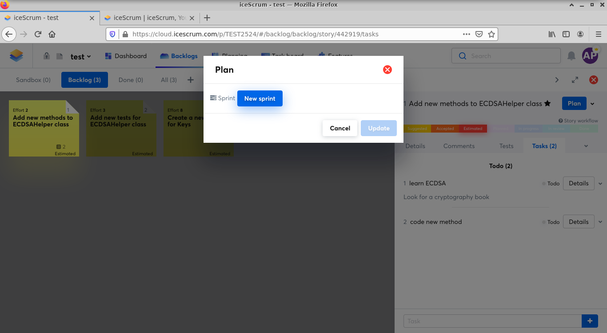
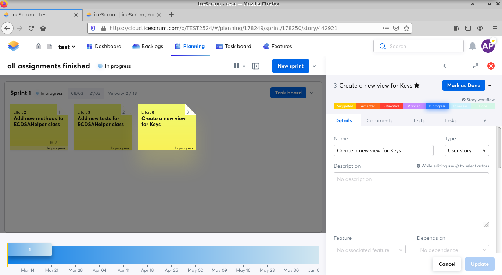

# SCRUM

- [Getting started](#getting-started-with-icescrum)  
- [Backlog and new Sprints](#preparing-the-backlog-and-starting-a-new-sprint)
- [Daily work with SCRUM](#working-daily-with-scrum-and-icescrum)
- [End of Sprint meetings](#end-of-sprint-meetings)

## Getting started with iceScrum

In this tutorial, you will learn how to register and create your own project
in iceScrum, a platform you must use to follow your progress in the assignments
of the Software Engineering course. The free version of iceScrum lets you create
your own project for a team of 3 members.

1. Go to https://www.icescrum.com/ and create an account:

2. Create a new project:

3. You can add a description and a unique key:

4. Create a team and invite the members of your team:

5. Select a start date and the length of the Sprint (by default, it is 14 days):

6. It's time to create new stories based on your assignments: 

7. Create several ones, enough to start a new Sprint. You can always
break stories into multiple tasks:

## Preparing the Product Backlog and starting a new Sprint

In each start of a Sprint meeting, you will agree on a subset of tasks
that will be part of the Sprint Backlog. 

How to the sandbox, select the tasks that you want to send to the Backlog
and click on "Mark as Accepted". They will appear in the Backlog.

You can also estimate the effort level:

Now, move the Backlog and "Plan" the tasks, to create
a new Sprint:

In order to do this, you will need to decide when you will make public a
new release of your product, that consists of a set of finished Sprints.
You can select the end date of the Software Engineering course:

Then, you can create a Sprint:

However, you will need to add some accepted tasks of the Backlog, click
on Plan and add them.

Now, activate the Sprint:

## Working daily with SCRUM and iceScrum

During your brief daily meetings you will discuss the progress of the
Sprint. It can be the case, some tasks are finished. You can always
mark them as Done:

## End of Sprint meetings

At this moment, you will have the opportunity to mark those tasks
that are finished done and to remove or move them to a new Sprint. 

